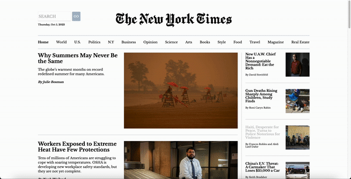
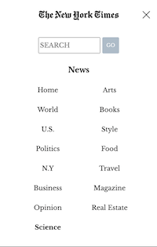

# The New York Times Clone

## Live Demo
You can see the live demo hosted on Netlify here: [The New York Times Clone](https://newyorktimesclonebyflavio.netlify.app)

## Technologies and libraries

### Frontend
- HTML5
- CSS3
- JavaScript
- TypeScript
- ReactJS
- Bootstrap 5
- React Bootstrap
- React Router Dom
- Axios
- Vite
- React Spinners
- React Icons

## Features
- News sourced from the official New York Times API
- News search
- Dropdown menu on mobile/tablet
- Browse news by various categories with different routes
- Responsive design for an optimized experience on different devices

## Screenshots and Videos

### Video

### Screenshots

## Contacts
- **Website:** [Your Website](#)
- **LinkedIn:** [Your LinkedIn Profile](#)